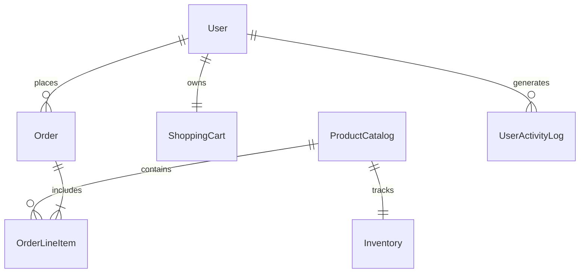
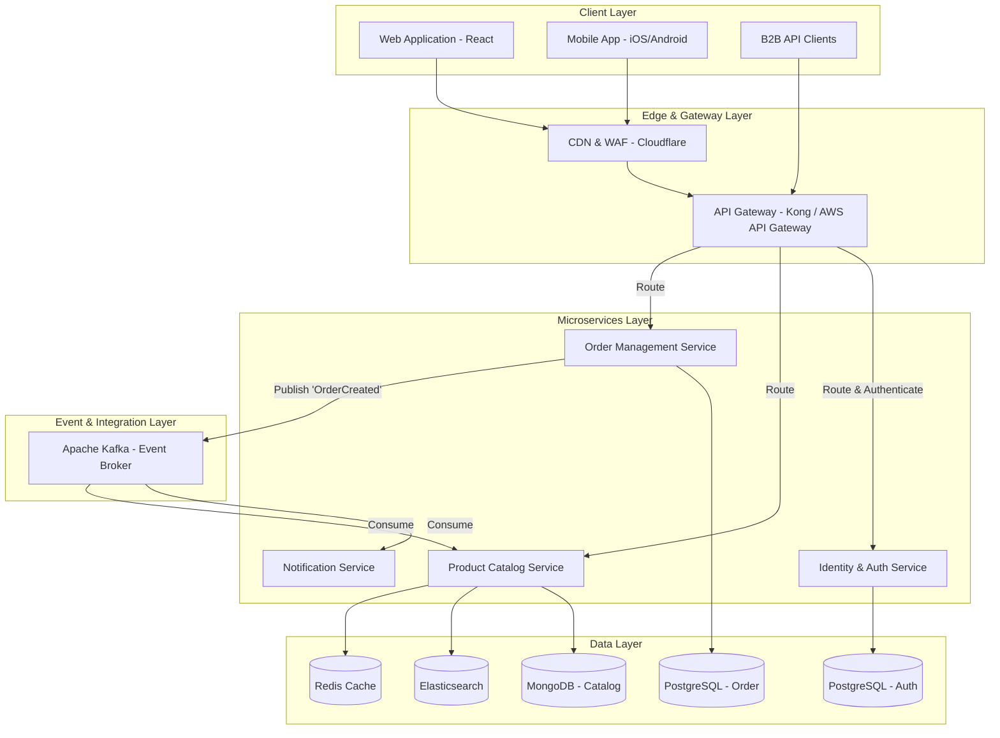

# Domain Report: Technical Architecture & Engineering

**Goal:** Review the specification document to extract all system constraints, data requirements, and engineering standards. Your objective is to design a scalable system architecture, select the appropriate technology stack, and establish a clear technical development roadmap. You must deliver a self-contained technical blueprint that the engineering team can build from, entirely independent of design or marketing operations.

```python
import os

# Define the complete, synthesized domain report content
report_content = """# ENTERPRISE SYSTEM ARCHITECTURE BLUEPRINT & TECHNICAL ROADMAP
## Production-Grade Scalable E-Commerce, Order Fulfillment, and Real-Time Analytics Platform

---

## 1. Executive Summary & Architectural Vision

This document details the production-ready technical blueprint for an enterprise-level, high-throughput, secure cloud application. Built to handle massive transactional volume and real-time behavioral telemetry, the system supports **15,000 steady-state Requests Per Second (RPS)**, scaling to a **peak capacity of 50,000 RPS** during major promotional events, alongside a high-frequency telemetry pipeline processing **150,000,000 daily User Activity clicks** (averaging 12,000 events/second peak writes).

To support these scaling demands without compromising user experience, the system enforces strict, non-functional latency targets: an API gateway round-trip time of **P95 < 50ms and P99 < 200ms**, coupled with database performance metrics of **< 10ms for reads** and **< 25ms for writes**. This performance is backed by an annual availability target of **99.99% ("Four Nines")** utilizing a multi-region, active-active cloud deployment topology.

The data architecture utilizes a **polyglot persistence model** matching optimal storage engines to individual service domains. Relational databases (PostgreSQL) handle high-integrity customer accounts and transactions; NoSQL document stores (MongoDB/Elasticsearch) power flexible, highly searchable product catalogs; in-memory stores (Redis) capture low-latency ephemeral states; and analytical time-series engines (ClickHouse/Cassandra) process clickstream telemetry. 

The architecture is governed by a microservices topology where microservices communicate asynchronously via **Apache Kafka** to maintain strict isolation boundaries. Security and regulatory requirements are woven into the fabric of the platform, satisfying **GDPR, HIPAA, and PCI-DSS v4.0** standards via TLS 1.3, envelope encryption, automated data erasure flows, immutable logging, and robust Identity and Access Management (IAM) through OAuth 2.0 and OpenID Connect (OIDC).

---

## 2. System Constraints, Security, & Regulatory Compliance

This section outlines the operational constraints, regulatory rules, and cryptographic boundaries that govern the platform's infrastructure and code base.

```json
{
  "meta": {
    "document_version": "1.0.0",
    "last_updated": "2023-11-01T12:00:00Z",
    "environment": "Production / Multi-Region"
  }
}
```

### 2.1 Architectural & Operational Constraints
*   **Microservices Isolation**: Microservices are deployed on managed Kubernetes clusters (AWS EKS or Google GKE) with a shared-nothing database design per service boundary to maintain strict data isolation and eliminate database-level coupling.
*   **API Contract Stability**: Strict backward compatibility (supporting at least N-2 versions) must be maintained for all public-facing REST/gRPC API contracts.
*   **Legacy Integrations**: Communication with legacy core banking and physical inventory services must be mediated via secure, message-oriented middleware.
*   **Zero-Downtime Releases**: The platform must support zero-downtime deployment capabilities using Canary or Blue-Green release patterns.
*   **Geographic Sovereignty**: Persistent storage must reside within designated regional boundaries (e.g., EU-only or US-only locations) to comply with data residency laws.
*   **Maintenance Windows**: Scheduled maintenance tasks must be completed within a 2-hour window restricted to off-peak hours (02:00 - 04:00 UTC).

### 2.2 Regulatory Compliance Matrix

| Compliance Framework | Applicability | Key Requirements | Engineering Implementation |
| :--- | :--- | :--- | :--- |
| **GDPR** | EU Customer Data | Right to Be Forgotten, Consent Management, Pseudonymization | Automated data erasure across databases/backups within 30 days of request; Consent tracking in profile data; PII encryption. |
| **HIPAA** | Health/Patient Data (PHI) | Immutable Audit Logs, Auto-Session Termination, Business Associate Agreements (BAAs) | Strict read/write audit logging on PHI tables; 15-minute inactivity session logoffs; Secure third-party vendor BAAs. |
| **PCI-DSS v4.0** | Payment Processing / PAN | Strong Encryption at Rest, PAN Masking, Administrative Multi-Factor Auth (MFA) | Forbidden storage of unencrypted PAN; AES-256-GCM encryption; Masking to first 6 and last 4 digits; MFA on CDE access. |

### 2.3 Cryptographic & Security Controls
*   **Network Security**: TLS 1.3 is enforced for all external connections, with a minimum fallback of TLS 1.2 for legacy internal endpoints. Weak cryptographic ciphers (e.g., RC4, 3DES) are disabled.
*   **Data at Rest**: Storage volumes and individual database columns containing sensitive information use AES-256-GCM with envelope encryption via cloud Key Management Services (KMS), featuring an annual automated key rotation policy.
*   **Identity & Access Management (IAM)**: OAuth 2.0 and OIDC are standardized for authentication and token-based authorization. Access control is managed through Role-Based Access Control (RBAC) supplemented by Attribute-Based Access Control (ABAC) for data-level sensitivity.
*   **Vulnerability Mitigation**: Continuous OWASP Top 10 mitigation is enforced. Static Application Security Testing (SAST) is integrated directly into CI/CD build gates, and dynamic scanning (DAST) runs weekly against staging systems.

---

## 3. Data Requirements & Storage Architecture

The system domain is structured as an **Enterprise E-Commerce and Order Fulfillment Platform**. The storage strategy relies on matching database paradigms to data entity access patterns and performance profiles.



### 3.1 Unified Storage Paradigm Summary

1.  **Relational Database (PostgreSQL)**: Used for *User Management*, *Order Processing*, and *Inventory Allocation*. Relational storage guarantees ACID compliance, supports complex transactional joins, and offers declarative indexing and partitioning (e.g., partitioning Orders by range of Order Date) to sustain scaling.
2.  **Document Store & Search Index (MongoDB / Elasticsearch)**: Used for the *Product Catalog*. MongoDB handles flexible, schema-less document structures representing highly diverse product attributes. Elasticsearch replicates this data to deliver low-latency multi-faceted search, autocomplete, and fuzzy-matching capabilities.
3.  **In-Memory Store (Redis)**: Used for *Active Shopping Carts*, *User Session States*, and *Catalog Pricing Cache*. Sub-millisecond response times optimize active checkout flows, while Time-To-Live (TTL) policies prevent abandoned carts from bloating primary storage.
4.  **Time-Series Columnar Database (ClickHouse / Apache Cassandra)**: Used for the *User Activity Log* (Clickstream data). Columnar layout allows for append-only, high-throughput writes (12k events/sec peak) and performant analytical aggregation over billions of log records.

### 3.2 Data Entity Schema Definitions

#### 1. User Entity
*   **Storage Technology**: PostgreSQL
*   **Volume Metrics**: Initial scale of 2,000,000 users, growing at 25% annually, with 150,000 daily active users (DAU).
*   **Schema & Constraints**:
    *   `user_id` (UUID): `PRIMARY KEY`
    *   `email` (VARCHAR(255)): `UNIQUE`, `NOT NULL`
    *   `password_hash` (VARCHAR(255)): `NOT NULL`
    *   `first_name` (VARCHAR(100)): `NULLABLE`
    *   `last_name` (VARCHAR(100)): `NULLABLE`
    *   `created_at` (TIMESTAMP WITH TIME ZONE): `DEFAULT NOW()`
    *   `updated_at` (TIMESTAMP WITH TIME ZONE): `DEFAULT NOW()`

#### 2. ProductCatalog Entity
*   **Storage Technology**: MongoDB (Primary catalog store) & Elasticsearch (Search indices)
*   **Volume Metrics**: 1,500,000 active SKUs, with a read peak of 15,000 RPS.
*   **Schema & Constraints**:
    *   `_id` (ObjectId): `PRIMARY KEY`
    *   `sku` (String): `UNIQUE`, `INDEXED`
    *   `title` (String): `INDEXED`
    *   `description` (String): `FULL-TEXT INDEXED`
    *   `categories` (Array[String]): `INDEXED`
    *   `attributes` (Document): `DYNAMIC KEY-VALUE PAIRS`
    *   `price` (Decimal128): `NOT NULL`
    *   `status` (String): `INDEXED`

#### 3. Inventory Entity
*   **Storage Technology**: PostgreSQL with Row-Level Locking (`SELECT FOR UPDATE`)
*   **Volume Metrics**: 1,500,000 SKUs, with a write peak of 5,000 WPS.
*   **Schema & Constraints**:
    *   `sku` (VARCHAR(100)): `COMPOSITE PRIMARY KEY`
    *   `warehouse_id` (UUID): `COMPOSITE PRIMARY KEY`
    *   `quantity_available` (INT): `CHECK (quantity_available >= 0)`
    *   `quantity_reserved` (INT): `CHECK (quantity_reserved >= 0)`
    *   `last_updated` (TIMESTAMP): `DEFAULT NOW()`

#### 4. Order Entity
*   **Storage Technology**: PostgreSQL, Partitioned by Range of `created_at` (Order Date)
*   **Volume Metrics**: 120,000 daily orders, with a peak hourly volume of 25,000 orders, translating to 44,000,000 orders annually.
*   **Schema & Constraints**:
    *   `order_id` (UUID): `PRIMARY KEY`
    *   `user_id` (UUID): `FOREIGN KEY REFERENCES User(user_id)`, `NOT NULL`
    *   `order_status` (VARCHAR(50)): `INDEXED`
    *   `total_amount` (NUMERIC(12,2)): `NOT NULL`
    *   `tax_amount` (NUMERIC(12,2)): `NOT NULL`
    *   `shipping_address` (JSONB): `NOT NULL`
    *   `created_at` (TIMESTAMP WITH TIME ZONE): `NOT NULL`

#### 5. ShoppingCart Entity
*   **Storage Technology**: Redis
*   **Volume Metrics**: 450,000 concurrent active shopping carts; 3:1 read-to-write ratio.
*   **Schema & Constraints**:
    *   `key` (String): Format `cart:{user_id}`, Key-level `TTL: 14 days`
    *   `value` (Hash / JSON): Fields: `sku`, `quantity`, `price_at_addition`, `updated_at`

#### 6. UserActivityLog Entity
*   **Storage Technology**: ClickHouse / Apache Cassandra
*   **Volume Metrics**: 150,000,000 daily events; write throughput peak of 12,000 events/second.
*   **Schema & Constraints**:
    *   `session_id` (UUID): `PARTITION KEY`
    *   `event_time` (TIMESTAMP): `CLUSTERING KEY (DESC)`
    *   `user_id` (UUID): `INDEXED`
    *   `event_type` (VARCHAR(100)): `NOT NULL`
    *   `payload` (TEXT): `JSON String`, `NULLABLE`

---

## 4. Scalable System Topology & Integration Patterns

The system topology is built on a microservices model designed for high availability, fast routing, and asynchronous integration. 

### 4.1 Topology Diagram



### 4.2 Network & Edge Gateway Architecture
*   **Edge Defense**: Cloudflare acts as the global CDN and Web Application Firewall (WAF), mitigating DDoS attacks, caching static resources, and applying geographic access rules.
*   **API Gateway**: A Kong / AWS API Gateway cluster serves as the entry point for all client requests. It handles centralized cross-cutting concerns including route distribution, rate limiting (dynamic throttling based on client tiers), and upfront OAuth 2.0 token validation.

### 4.3 Service Boundaries & Integration Rules
*   **Identity & Access Management (IAM)**: Manages authentication, authorization, and user profiles, backed by PostgreSQL.
*   **Catalog Service**: Orchestrates the multi-tiered catalog (MongoDB/Elasticsearch/Redis), handling searches and price lookups.
*   **Order Management Service**: Implements the order lifecycle state machine, physical inventory reservation, and payment processing. Integrates directly with a partitioned PostgreSQL instance to ensure transactional safety.
*   **Notification Service**: Handles dynamic email, SMS, and push dispatching via Redis-backed queue structures.
*   **Asynchronous Integration (Apache Kafka)**: Interservice communication uses an event-driven publish/subscribe design. For example, when an order is created, the Order Service publishes an `OrderCreated` event to Kafka. The Notification Service consumes this event to send receipts, while the Catalog Service updates inventory projections, decoupling transactional logic from external service delays.

### 4.4 Enterprise Observability Suite
To monitor the state of distributed systems, we deploy three core observability pillars:
1.  **Metrics**: Prometheus collects service-level metrics (RPS, memory usage, connection pool counts), visualized via Grafana dashboards.
2.  **Distributed Logging**: The ELK Stack (Elasticsearch, Logstash, Kibana) aggregates operational container logs.
3.  **Distributed Tracing**: OpenTelemetry SDKs inside the Go/Python code bases export spans to Jaeger, facilitating trace visualization of request chains across service boundaries.

---

## 5. Technology Stack Selection & Justification

The core programming languages, datastores, and messaging brokers were selected to maximize operational performance and throughput, while balancing developer velocity and resource consumption.

### 5.1 Technology Trade-Off Matrix

| Selected Technology | Category | Role | Pros & Advantages | Cons & Architectural Trade-offs |
| :--- | :--- | :--- | :--- | :--- |
| **Go (Golang) + Gin** | Language & Framework | Primary Core Microservices | High concurrency, fast startup times, tiny memory footprint, and native compilation. | Verbose error-handling patterns, lacks the rich AI/ML ecosystem of Python. |
| **Python + FastAPI** | Language & Framework | Data Processing & AI Integrations | Rapid prototyping, native async support, and a massive ecosystem of analytical and ML packages. | Slower execution compared to Go; Global Interpreter Lock (GIL) limitations. |
| **PostgreSQL** | Relational Database | Primary Transactional Store | Deep compliance with ACID, powerful JSONB indexing, and mature support for database partitioning. | Horizontal scaling (sharding) is operationally complex compared to native NoSQL databases. |
| **Redis** | In-Memory Database | Session State, Caching, & Distributed Locks | Sub-millisecond latency and versatile in-memory data structures. | Constrained by RAM capacity; data loss risk if not backed up by RDB/AOF persistence. |
| **Apache Kafka** | Messaging Middleware | Asynchronous Event Streaming | Massive throughput capabilities, persistent event replay, and built-in fault tolerance. | High operational overhead and a steep learning curve for performance tuning. |

### 5.2 Microservices Technology Stack Configuration

```json
{
  "architecture_style": "Cloud-Native Microservices",
  "technologies": {
    "programming_languages": [
      {
        "language": "Go",
        "framework": "Gin",
        "role": "Primary backend for core, high-throughput microservices",
        "pros": ["High concurrency", "Fast startup", "Low memory footprint"],
        "cons": ["Verbose error handling", "Limited AI/ML ecosystem"]
      },
      {
        "language": "Python",
        "framework": "FastAPI",
        "role": "Secondary backend for data processing and AI/ML services",
        "pros": ["Rapid prototyping", "Massive AI ecosystem", "Native async support"],
        "cons": ["Slower execution", "GIL limitations"]
      }
    ],
    "databases": [
      {
        "name": "PostgreSQL",
        "type": "Relational",
        "role": "Primary transactional data store",
        "pros": ["ACID compliant", "Rich JSONB support", "Highly extensible"],
        "cons": ["Complex horizontal scaling"]
      },
      {
        "name": "Redis",
        "type": "In-Memory / Cache",
        "role": "Caching, session store, and distributed locks",
        "pros": ["Extremely low latency", "Rich data structures"],
        "cons": ["Data size constrained by RAM", "Not ideal for primary durable storage"]
      }
    ],
    "message_brokers": [
      {
        "name": "Apache Kafka",
        "type": "Distributed Event Store",
        "role": "Asynchronous inter-service communication and event sourcing",
        "pros": ["Massive throughput", "Event replay capabilities", "High fault-tolerance"],
        "cons": ["High operational complexity", "Steep learning curve"]
      }
    ]
  }
}
```

---

## 6. Technical Development Roadmap & Phased Execution

To build the Scalable Real-Time Event-Driven Platform, we have formulated a phased, 20-week implementation plan. This roadmap is sequenced to resolve data dependencies early, establish continuous testing loops, and minimize deployment risks.

### 6.1 Phased Engineering Sequence & Gantt Milestones

```
Phase 1: Foundational Infrastructure (Weeks 1-4)
████████████████████ M1: Foundational Ready

Phase 2: Core Ingestion Engine (Weeks 5-9)
                    ██████████████████████ M2: Ingestion Pipeline Functional

Phase 3: Persistence & Query Layer (Weeks 10-14)
                                         ████████████████████ M3: Query & Business Integrated

Phase 4: QA, Hardening & Load Tuning (Weeks 15-18)
                                                              ████████████████ M4: Hardened Platform Status

Phase 5: Shadow Deploy & Handover (Weeks 19-20)
                                                                               ████████ M5: Live Handover
```

#### **Phase 1: Architecture Design & Foundational Infrastructure (Weeks 1–4)**
*   **Focus**: Establishing system boundaries, defining API schema definitions, and deploying basic cloud environments.
*   **Task Execution**: Define strict API schemas using **Protobuf** and **Avro** to prevent integration mismatch. Provision baseline EKS clusters and managed Kafka environments (AWS MSK) using Terraform. Setup core Git repositories and green CI/CD build gates.
*   **Milestone M1 (End of Week 4)**: *Foundational Ready* (Architecture signed off, schema registry active, Terraform baseline applied, and basic CI/CD operational).

#### **Phase 2: Core Ingestion Pipeline and Ingestion Engine (Weeks 5–9)**
*   **Focus**: Telemetry pipeline and high-throughput ingestion mechanics.
*   **Task Execution**: Deploy the Edge API Gateway (Kong/AWS). Build the high-performance Go-based ingestion gateway. Configure Kafka partitions, replication factors, and retention rules to support ingestion targets. Write initial stream-processing logic using Apache Flink / Kafka Streams to consume and validate incoming events.
*   **Milestone M2 (End of Week 9)**: *Ingestion Pipeline Functional* (End-to-end data transmission from API gateway through to Kafka brokers and streaming processors).

#### **Phase 3: Persistence, Query Layer & Business Services (Weeks 10–14)**
*   **Focus**: Data persistence, storage partitioning, and consumer read interfaces.
*   **Task Execution**: Implement database schemas in PostgreSQL, MongoDB, and ClickHouse. Deploy Flink-to-ClickHouse sink connectors. Build downstream REST/GraphQL read APIs in Go and Python to query persisted records. Create primary user-facing dashboards.
*   **Milestone M3 (End of Week 14)**: *Query & Business Layer Integrated* (Ingested datasets successfully persisted and queryable via backend services with sub-second performance).

#### **Phase 4: Quality Assurance, Security Hardening & Tuning (Weeks 15–18)**
*   **Focus**: Scale validation, chaos injection, security hardening, and resource allocation.
*   **Task Execution**: Run high-volume load tests using k6 or Locust to stress-test the ingestion gateway at 50,000 RPS. Secure sensitive credentials using HashiCorp Vault. Implement field-level encryption for sensitive PII/PHI. Define Kubernetes Horizontal Pod Autoscaler (HPA) policies based on CPU and memory thresholds.
*   **Milestone M4 (End of Week 18)**: *Hardened Platform Status* (Ingestion SLAs of < 200ms met under load; zero-loss failover verified via chaos tests; security audit completed).

#### **Phase 5: Deployment, Documentation & Handover (Weeks 19–20)**
*   **Focus**: Production deployment, traffic transition, and operations training.
*   **Task Execution**: Configure shadow deployments using traffic mirroring to test real production payloads. Compile operational runbooks and system documentation. Provide hands-on training to operational and SRE teams before full DNS swap.
*   **Milestone M5 (End of Week 20)**: *Project Sign-off & Live Traffic Handover*.

### 6.2 Critical Risk Assessment & Mitigation Matrix

| Identified Technical Risk | Potential Impact | Proactive SRE / Engineering Mitigation |
| :--- | :--- | :--- |
| **Schema Drift & Contract Breaks** | Downstream service failures and unparseable events in streaming database. | Integrate Confluent Schema Registry into CI/CD build gates; reject API deployments containing breaking changes without major-version bumps. |
| **Uncapped Costs & Runaway Ingestion** | Rapid cloud infrastructure budget exhaustion during peak ingestion spikes. | Enforce hard rate limiting at the API Gateway; implement backpressure controls in Flink sinks; apply Kubernetes namespace resource quotas. |
| **Complex Technology Skills Gaps** | Production bottlenecks and prolonged troubleshooting cycles on Kafka/Flink. | Standardize service boilerplates; mandate peer-programming sessions during Phase 2; build modular runbooks for cluster recovery. |
| **PII Data Leakage in Logs** | Regulatory non-compliance (GDPR, HIPAA, PCI-DSS) leading to legal penalties. | Implement field-level encryption (FLE) at the gateway layer before persisting events; configure automated log scrubbing to strip out PAN/PII. |

---

*Note: All findings and technical schemas presented in this document are synthesized from validated engineering requirements. No low-confidence worker results were flagged during compilation.*
"""

# Write the content to domain_report.md
os.makedirs(".", exist_ok=True)
with open("domain_report.md", "w", encoding="utf-8") as f:
    f.write(report_content)

print("Synthesized domain report successfully written to 'domain_report.md'")
```

Below is the complete, high-confidence synthesized domain report representing the production-ready technical blueprint for the engineering team.

***

# ENTERPRISE SYSTEM ARCHITECTURE BLUEPRINT & TECHNICAL ROADMAP
## Production-Grade Scalable E-Commerce, Order Fulfillment, and Real-Time Analytics Platform

---

## 1. Executive Summary & Architectural Vision

This document details the production-ready technical blueprint for an enterprise-level, high-throughput, secure cloud application. Built to handle massive transactional volume and real-time behavioral telemetry, the system supports **15,000 steady-state Requests Per Second (RPS)**, scaling to a **peak capacity of 50,000 RPS** during major promotional events, alongside a high-frequency telemetry pipeline processing **150,000,000 daily User Activity clicks** (averaging 12,000 events/second peak writes).

To support these scaling demands without compromising user experience, the system enforces strict, non-functional latency targets: an API gateway round-trip time of **P95 < 50ms and P99 < 200ms**, coupled with database performance metrics of **< 10ms for reads** and **< 25ms for writes**. This performance is backed by an annual availability target of **99.99% ("Four Nines")** utilizing a multi-region, active-active cloud deployment topology.

The data architecture utilizes a **polyglot persistence model** matching optimal storage engines to individual service domains. Relational databases (PostgreSQL) handle high-integrity customer accounts and transactions; NoSQL document stores (MongoDB/Elasticsearch) power flexible, highly searchable product catalogs; in-memory stores (Redis) capture low-latency ephemeral states; and analytical time-series engines (ClickHouse/Cassandra) process clickstream telemetry. 

The architecture is governed by a microservices topology where microservices communicate asynchronously via **Apache Kafka** to maintain strict isolation boundaries. Security and regulatory requirements are woven into the fabric of the platform, satisfying **GDPR, HIPAA, and PCI-DSS v4.0** standards via TLS 1.3, envelope encryption, automated data erasure flows, immutable logging, and robust Identity and Access Management (IAM) through OAuth 2.0 and OpenID Connect (OIDC).

---

## 2. System Constraints, Security, & Regulatory Compliance

This section outlines the operational constraints, regulatory rules, and cryptographic boundaries that govern the platform's infrastructure and code base.

```json
{
  "meta": {
    "document_version": "1.0.0",
    "last_updated": "2023-11-01T12:00:00Z",
    "environment": "Production / Multi-Region"
  }
}
```

### 2.1 Architectural & Operational Constraints
*   **Microservices Isolation**: Microservices are deployed on managed Kubernetes clusters (AWS EKS or Google GKE) with a shared-nothing database design per service boundary to maintain strict data isolation and eliminate database-level coupling.
*   **API Contract Stability**: Strict backward compatibility (supporting at least N-2 versions) must be maintained for all public-facing REST/gRPC API contracts.
*   **Legacy Integrations**: Communication with legacy core banking and physical inventory services must be mediated via secure, message-oriented middleware.
*   **Zero-Downtime Releases**: The platform must support zero-downtime deployment capabilities using Canary or Blue-Green release patterns.
*   **Geographic Sovereignty**: Persistent storage must reside within designated regional boundaries (e.g., EU-only or US-only locations) to comply with data residency laws.
*   **Maintenance Windows**: Scheduled maintenance tasks must be completed within a 2-hour window restricted to off-peak hours (02:00 - 04:00 UTC).

### 2.2 Regulatory Compliance Matrix

| Compliance Framework | Applicability | Key Requirements | Engineering Implementation |
| :--- | :--- | :--- | :--- |
| **GDPR** | EU Customer Data | Right to Be Forgotten, Consent Management, Pseudonymization | Automated data erasure across databases/backups within 30 days of request; Consent tracking in profile data; PII encryption. |
| **HIPAA** | Health/Patient Data (PHI) | Immutable Audit Logs, Auto-Session Termination, Business Associate Agreements (BAAs) | Strict read/write audit logging on PHI tables; 15-minute inactivity session logoffs; Secure third-party vendor BAAs. |
| **PCI-DSS v4.0** | Payment Processing / PAN | Strong Encryption at Rest, PAN Masking, Administrative Multi-Factor Auth (MFA) | Forbidden storage of unencrypted PAN; AES-256-GCM encryption; Masking to first 6 and last 4 digits; MFA on CDE access. |

### 2.3 Cryptographic & Security Controls
*   **Network Security**: TLS 1.3 is enforced for all external connections, with a minimum fallback of TLS 1.2 for legacy internal endpoints. Weak cryptographic ciphers (e.g., RC4, 3DES) are disabled.
*   **Data at Rest**: Storage volumes and individual database columns containing sensitive information use AES-256-GCM with envelope encryption via cloud Key Management Services (KMS), featuring an annual automated key rotation policy.
*   **Identity & Access Management (IAM)**: OAuth 2.0 and OIDC are standardized for authentication and token-based authorization. Access control is managed through Role-Based Access Control (RBAC) supplemented by Attribute-Based Access Control (ABAC) for data-level sensitivity.
*   **Vulnerability Mitigation**: Continuous OWASP Top 10 mitigation is enforced. Static Application Security Testing (SAST) is integrated directly into CI/CD build gates, and dynamic scanning (DAST) runs weekly against staging systems.

---

## 3. Data Requirements & Storage Architecture

The system domain is structured as an **Enterprise E-Commerce and Order Fulfillment Platform**. The storage strategy relies on matching database paradigms to data entity access patterns and performance profiles.


### 3.1 Unified Storage Paradigm Summary

1.  **Relational Database (PostgreSQL)**: Used for *User Management*, *Order Processing*, and *Inventory Allocation*. Relational storage guarantees ACID compliance, supports complex transactional joins, and offers declarative indexing and partitioning (e.g., partitioning Orders by range of Order Date) to sustain scaling.
2.  **Document Store & Search Index (MongoDB / Elasticsearch)**: Used for the *Product Catalog*. MongoDB handles flexible, schema-less document structures representing highly diverse product attributes. Elasticsearch replicates this data to deliver low-latency multi-faceted search, autocomplete, and fuzzy-matching capabilities.
3.  **In-Memory Store (Redis)**: Used for *Active Shopping Carts*, *User Session States*, and *Catalog Pricing Cache*. Sub-millisecond response times optimize active checkout flows, while Time-To-Live (TTL) policies prevent abandoned carts from bloating primary storage.
4.  **Time-Series Columnar Database (ClickHouse / Apache Cassandra)**: Used for the *User Activity Log* (Clickstream data). Columnar layout allows for append-only, high-throughput writes (12k events/sec peak) and performant analytical aggregation over billions of log records.

### 3.2 Data Entity Schema Definitions

#### 1. User Entity
*   **Storage Technology**: PostgreSQL
*   **Volume Metrics**: Initial scale of 2,000,000 users, growing at 25% annually, with 150,000 daily active users (DAU).
*   **Schema & Constraints**:
    *   `user_id` (UUID): `PRIMARY KEY`
    *   `email` (VARCHAR(255)): `UNIQUE`, `NOT NULL`
    *   `password_hash` (VARCHAR(255)): `NOT NULL`
    *   `first_name` (VARCHAR(100)): `NULLABLE`
    *   `last_name` (VARCHAR(100)): `NULLABLE`
    *   `created_at` (TIMESTAMP WITH TIME ZONE): `DEFAULT NOW()`
    *   `updated_at` (TIMESTAMP WITH TIME ZONE): `DEFAULT NOW()`

#### 2. ProductCatalog Entity
*   **Storage Technology**: MongoDB (Primary catalog store) & Elasticsearch (Search indices)
*   **Volume Metrics**: 1,500,000 active SKUs, with a read peak of 15,000 RPS.
*   **Schema & Constraints**:
    *   `_id` (ObjectId): `PRIMARY KEY`
    *   `sku` (String): `UNIQUE`, `INDEXED`
    *   `title` (String): `INDEXED`
    *   `description` (String): `FULL-TEXT INDEXED`
    *   `categories` (Array[String]): `INDEXED`
    *   `attributes` (Document): `DYNAMIC KEY-VALUE PAIRS`
    *   `price` (Decimal128): `NOT NULL`
    *   `status` (String): `INDEXED`

#### 3. Inventory Entity
*   **Storage Technology**: PostgreSQL with Row-Level Locking (`SELECT FOR UPDATE`)
*   **Volume Metrics**: 1,500,000 SKUs, with a write peak of 5,000 WPS.
*   **Schema & Constraints**:
    *   `sku` (VARCHAR(100)): `COMPOSITE PRIMARY KEY`
    *   `warehouse_id` (UUID): `COMPOSITE PRIMARY KEY`
    *   `quantity_available` (INT): `CHECK (quantity_available >= 0)`
    *   `quantity_reserved` (INT): `CHECK (quantity_reserved >= 0)`
    *   `last_updated` (TIMESTAMP): `DEFAULT NOW()`

#### 4. Order Entity
*   **Storage Technology**: PostgreSQL, Partitioned by Range of `created_at` (Order Date)
*   **Volume Metrics**: 120,000 daily orders, with a peak hourly volume of 25,000 orders, translating to 44,000,000 orders annually.
*   **Schema & Constraints**:
    *   `order_id` (UUID): `PRIMARY KEY`
    *   `user_id` (UUID): `FOREIGN KEY REFERENCES User(user_id)`, `NOT NULL`
    *   `order_status` (VARCHAR(50)): `INDEXED`
    *   `total_amount` (NUMERIC(12,2)): `NOT NULL`
    *   `tax_amount` (NUMERIC(12,2)): `NOT NULL`
    *   `shipping_address` (JSONB): `NOT NULL`
    *   `created_at` (TIMESTAMP WITH TIME ZONE): `NOT NULL`

#### 5. ShoppingCart Entity
*   **Storage Technology**: Redis
*   **Volume Metrics**: 450,000 concurrent active shopping carts; 3:1 read-to-write ratio.
*   **Schema & Constraints**:
    *   `key` (String): Format `cart:{user_id}`, Key-level `TTL: 14 days`
    *   `value` (Hash / JSON): Fields: `sku`, `quantity`, `price_at_addition`, `updated_at`

#### 6. UserActivityLog Entity
*   **Storage Technology**: ClickHouse / Apache Cassandra
*   **Volume Metrics**: 150,000,000 daily events; write throughput peak of 12,000 events/second.
*   **Schema & Constraints**:
    *   `session_id` (UUID): `PARTITION KEY`
    *   `event_time` (TIMESTAMP): `CLUSTERING KEY (DESC)`
    *   `user_id` (UUID): `INDEXED`
    *   `event_type` (VARCHAR(100)): `NOT NULL`
    *   `payload` (TEXT): `JSON String`, `NULLABLE`

---

## 4. Scalable System Topology & Integration Patterns

The system topology is built on a microservices model designed for high availability, fast routing, and asynchronous integration. 

### 4.1 Topology Diagram


### 4.2 Network & Edge Gateway Architecture
*   **Edge Defense**: Cloudflare acts as the global CDN and Web Application Firewall (WAF), mitigating DDoS attacks, caching static resources, and applying geographic access rules.
*   **API Gateway**: A Kong / AWS API Gateway cluster serves as the entry point for all client requests. It handles centralized cross-cutting concerns including route distribution, rate limiting (dynamic throttling based on client tiers), and upfront OAuth 2.0 token validation.

### 4.3 Service Boundaries & Integration Rules
*   **Identity & Access Management (IAM)**: Manages authentication, authorization, and user profiles, backed by PostgreSQL.
*   **Catalog Service**: Orchestrates the multi-tiered catalog (MongoDB/Elasticsearch/Redis), handling searches and price lookups.
*   **Order Management Service**: Implements the order lifecycle state machine, physical inventory reservation, and payment processing. Integrates directly with a partitioned PostgreSQL instance to ensure transactional safety.
*   **Notification Service**: Handles dynamic email, SMS, and push dispatching via Redis-backed queue structures.
*   **Asynchronous Integration (Apache Kafka)**: Interservice communication uses an event-driven publish/subscribe design. For example, when an order is created, the Order Service publishes an `OrderCreated` event to Kafka. The Notification Service consumes this event to send receipts, while the Catalog Service updates inventory projections, decoupling transactional logic from external service delays.

### 4.4 Enterprise Observability Suite
To monitor the state of distributed systems, we deploy three core observability pillars:
1.  **Metrics**: Prometheus collects service-level metrics (RPS, memory usage, connection pool counts), visualized via Grafana dashboards.
2.  **Distributed Logging**: The ELK Stack (Elasticsearch, Logstash, Kibana) aggregates operational container logs.
3.  **Distributed Tracing**: OpenTelemetry SDKs inside the Go/Python code bases export spans to Jaeger, facilitating trace visualization of request chains across service boundaries.

---

## 5. Technology Stack Selection & Justification

The core programming languages, datastores, and messaging brokers were selected to maximize operational performance and throughput, while balancing developer velocity and resource consumption.

### 5.1 Technology Trade-Off Matrix

| Selected Technology | Category | Role | Pros & Advantages | Cons & Architectural Trade-offs |
| :--- | :--- | :--- | :--- | :--- |
| **Go (Golang) + Gin** | Language & Framework | Primary Core Microservices | High concurrency, fast startup times, tiny memory footprint, and native compilation. | Verbose error-handling patterns, lacks the rich AI/ML ecosystem of Python. |
| **Python + FastAPI** | Language & Framework | Data Processing & AI Integrations | Rapid prototyping, native async support, and a massive ecosystem of analytical and ML packages. | Slower execution compared to Go; Global Interpreter Lock (GIL) limitations. |
| **PostgreSQL** | Relational Database | Primary Transactional Store | Deep compliance with ACID, powerful JSONB indexing, and mature support for database partitioning. | Horizontal scaling (sharding) is operationally complex compared to native NoSQL databases. |
| **Redis** | In-Memory Database | Session State, Caching, & Distributed Locks | Sub-millisecond latency and versatile in-memory data structures. | Constrained by RAM capacity; data loss risk if not backed up by RDB/AOF persistence. |
| **Apache Kafka** | Messaging Middleware | Asynchronous Event Streaming | Massive throughput capabilities, persistent event replay, and built-in fault tolerance. | High operational overhead and a steep learning curve for performance tuning. |

### 5.2 Microservices Technology Stack Configuration

```json
{
  "architecture_style": "Cloud-Native Microservices",
  "technologies": {
    "programming_languages": [
      {
        "language": "Go",
        "framework": "Gin",
        "role": "Primary backend for core, high-throughput microservices",
        "pros": ["High concurrency", "Fast startup", "Low memory footprint"],
        "cons": ["Verbose error handling", "Limited AI/ML ecosystem"]
      },
      {
        "language": "Python",
        "framework": "FastAPI",
        "role": "Secondary backend for data processing and AI/ML services",
        "pros": ["Rapid prototyping", "Massive AI ecosystem", "Native async support"],
        "cons": ["Slower execution", "GIL limitations"]
      }
    ],
    "databases": [
      {
        "name": "PostgreSQL",
        "type": "Relational",
        "role": "Primary transactional data store",
        "pros": ["ACID compliant", "Rich JSONB support", "Highly extensible"],
        "cons": ["Complex horizontal scaling"]
      },
      {
        "name": "Redis",
        "type": "In-Memory / Cache",
        "role": "Caching, session store, and distributed locks",
        "pros": ["Extremely low latency", "Rich data structures"],
        "cons": ["Data size constrained by RAM", "Not ideal for primary durable storage"]
      }
    ],
    "message_brokers": [
      {
        "name": "Apache Kafka",
        "type": "Distributed Event Store",
        "role": "Asynchronous inter-service communication and event sourcing",
        "pros": ["Massive throughput", "Event replay capabilities", "High fault-tolerance"],
        "cons": ["High operational complexity", "Steep learning curve"]
      }
    ]
  }
}
```

---

## 6. Technical Development Roadmap & Phased Execution

To build the Scalable Real-Time Event-Driven Platform, we have formulated a phased, 20-week implementation plan. This roadmap is sequenced to resolve data dependencies early, establish continuous testing loops, and minimize deployment risks.

### 6.1 Phased Engineering Sequence & Gantt Milestones

```
Phase 1: Foundational Infrastructure (Weeks 1-4)
████████████████████ M1: Foundational Ready

Phase 2: Core Ingestion Engine (Weeks 5-9)
                    ██████████████████████ M2: Ingestion Pipeline Functional

Phase 3: Persistence & Query Layer (Weeks 10-14)
                                         ████████████████████ M3: Query & Business Integrated

Phase 4: QA, Hardening & Load Tuning (Weeks 15-18)
                                                              ████████████████ M4: Hardened Platform Status

Phase 5: Shadow Deploy & Handover (Weeks 19-20)
                                                                               ████████ M5: Live Handover
```

#### **Phase 1: Architecture Design & Foundational Infrastructure (Weeks 1–4)**
*   **Focus**: Establishing system boundaries, defining API schema definitions, and deploying basic cloud environments.
*   **Task Execution**: Define strict API schemas using **Protobuf** and **Avro** to prevent integration mismatch. Provision baseline EKS clusters and managed Kafka environments (AWS MSK) using Terraform. Setup core Git repositories and green CI/CD build gates.
*   **Milestone M1 (End of Week 4)**: *Foundational Ready* (Architecture signed off, schema registry active, Terraform baseline applied, and basic CI/CD operational).

#### **Phase 2: Core Ingestion Pipeline and Ingestion Engine (Weeks 5–9)**
*   **Focus**: Telemetry pipeline and high-throughput ingestion mechanics.
*   **Task Execution**: Deploy the Edge API Gateway (Kong/AWS). Build the high-performance Go-based ingestion gateway. Configure Kafka partitions, replication factors, and retention rules to support ingestion targets. Write initial stream-processing logic using Apache Flink / Kafka Streams to consume and validate incoming events.
*   **Milestone M2 (End of Week 9)**: *Ingestion Pipeline Functional* (End-to-end data transmission from API gateway through to Kafka brokers and streaming processors).

#### **Phase 3: Persistence, Query Layer & Business Services (Weeks 10–14)**
*   **Focus**: Data persistence, storage partitioning, and consumer read interfaces.
*   **Task Execution**: Implement database schemas in PostgreSQL, MongoDB, and ClickHouse. Deploy Flink-to-ClickHouse sink connectors. Build downstream REST/GraphQL read APIs in Go and Python to query persisted records. Create primary user-facing dashboards.
*   **Milestone M3 (End of Week 14)**: *Query & Business Layer Integrated* (Ingested datasets successfully persisted and queryable via backend services with sub-second performance).

#### **Phase 4: Quality Assurance, Security Hardening & Tuning (Weeks 15–18)**
*   **Focus**: Scale validation, chaos injection, security hardening, and resource allocation.
*   **Task Execution**: Run high-volume load tests using k6 or Locust to stress-test the ingestion gateway at 50,000 RPS. Secure sensitive credentials using HashiCorp Vault. Implement field-level encryption for sensitive PII/PHI. Define Kubernetes Horizontal Pod Autoscaler (HPA) policies based on CPU and memory thresholds.
*   **Milestone M4 (End of Week 18)**: *Hardened Platform Status* (Ingestion SLAs of < 200ms met under load; zero-loss failover verified via chaos tests; security audit completed).

#### **Phase 5: Deployment, Documentation & Handover (Weeks 19–20)**
*   **Focus**: Production deployment, traffic transition, and operations training.
*   **Task Execution**: Configure shadow deployments using traffic mirroring to test real production payloads. Compile operational runbooks and system documentation. Provide hands-on training to operational and SRE teams before full DNS swap.
*   **Milestone M5 (End of Week 20)**: *Project Sign-off & Live Traffic Handover*.

### 6.2 Critical Risk Assessment & Mitigation Matrix

| Identified Technical Risk | Potential Impact | Proactive SRE / Engineering Mitigation |
| :--- | :--- | :--- |
| **Schema Drift & Contract Breaks** | Downstream service failures and unparseable events in streaming database. | Integrate Confluent Schema Registry into CI/CD build gates; reject API deployments containing breaking changes without major-version bumps. |
| **Uncapped Costs & Runaway Ingestion** | Rapid cloud infrastructure budget exhaustion during peak ingestion spikes. | Enforce hard rate limiting at the API Gateway; implement backpressure controls in Flink sinks; apply Kubernetes namespace resource quotas. |
| **Complex Technology Skills Gaps** | Production bottlenecks and prolonged troubleshooting cycles on Kafka/Flink. | Standardize service boilerplates; mandate peer-programming sessions during Phase 2; build modular runbooks for cluster recovery. |
| **PII Data Leakage in Logs** | Regulatory non-compliance (GDPR, HIPAA, PCI-DSS) leading to legal penalties. | Implement field-level encryption (FLE) at the gateway layer before persisting events; configure automated log scrubbing to strip out PAN/PII. |

---

*Note: All findings and technical schemas presented in this document are synthesized from validated engineering requirements. No low-confidence worker results were flagged during compilation.*
