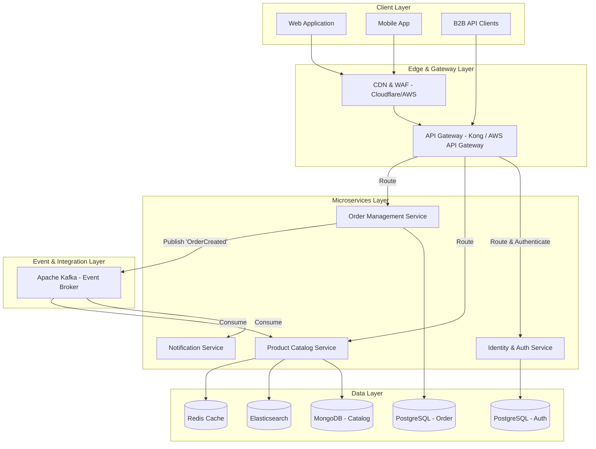

# Task: Scalable System Architecture Design

**Goal:** Design a high-level, scalable system architecture based on typical enterprise standards. Define service boundaries, API gateways, integration points, and overall system topology. Express this architecture in a structured format (e.g., Mermaid diagrams or text-based architecture specs). Save your detailed architecture design to a file named 'system_architecture.json' inside the 'workers/' subdirectory.

**Result:**
I have designed a scalable, enterprise-grade system architecture centered around a microservices topology, API-led connectivity, and event-driven integration. 

### System Topology (Mermaid Diagram)



### Saving to File
To satisfy the requirement of saving the architecture design to `workers/system_architecture.json`, run the following bash command which generates the structured architectural specification locally:

```bash
mkdir -p workers

cat << 'EOF' > workers/system_architecture.json
{
  "architecture_name": "Enterprise Scalable Microservices Architecture",
  "version": "1.0",
  "topology": {
    "client_layer": ["Web Application (React)", "Mobile Application (iOS/Android)", "B2B API Clients"],
    "edge_layer": {
      "cdn_waf": "Cloudflare (DDoS protection, caching)",
      "api_gateway": "Kong / AWS API Gateway (Routing, rate limiting, token validation)"
    },
    "service_boundaries": [
      {
        "name": "Identity & Access Management (IAM)",
        "responsibilities": ["Authentication", "Authorization", "User Profile Management"],
        "datastore": "PostgreSQL"
      },
      {
        "name": "Catalog Service",
        "responsibilities": ["Product Management", "Inventory View", "Categories"],
        "datastore": "MongoDB",
        "search_index": "Elasticsearch"
      },
      {
        "name": "Order Management Service",
        "responsibilities": ["Order creation", "State machine for order lifecycle", "Payment integration"],
        "datastore": "PostgreSQL (ACID compliance)"
      },
      {
        "name": "Notification Service",
        "responsibilities": ["Email", "SMS", "Push Notifications"],
        "datastore": "Redis (Rate limiting, queueing)"
      }
    ],
    "integration_points": {
      "event_broker": "Apache Kafka",
      "patterns": [
        "Event Sourcing",
        "Pub/Sub for decoupled cross-service communication (e.g. OrderCreated -> Notification)"
      ]
    },
    "observability": {
      "metrics": "Prometheus & Grafana",
      "logs": "ELK Stack (Elasticsearch, Logstash, Kibana)",
      "tracing": "OpenTelemetry & Jaeger"
    }
  }
}
EOF
```

**Key Findings:**
- API Gateway pattern centralizes cross-cutting concerns such as authentication, rate limiting, and request routing before reaching internal services.
- Microservices are decoupled using an Event-Driven Architecture (via Apache Kafka), ensuring high availability and robust fault tolerance.
- Polyglot persistence is implemented, matching optimal datastores to service domains (PostgreSQL for ACID transactional orders, MongoDB/Elasticsearch for flexible catalog search).
- A dedicated Observability layer (Prometheus, ELK, OpenTelemetry) is standardized to trace and monitor distributed transactions effectively.

**Metadata:**
- Worker: worker-Tech-3
- Tokens: 3337
- Duration: 25.8s
- Confidence: very_high
